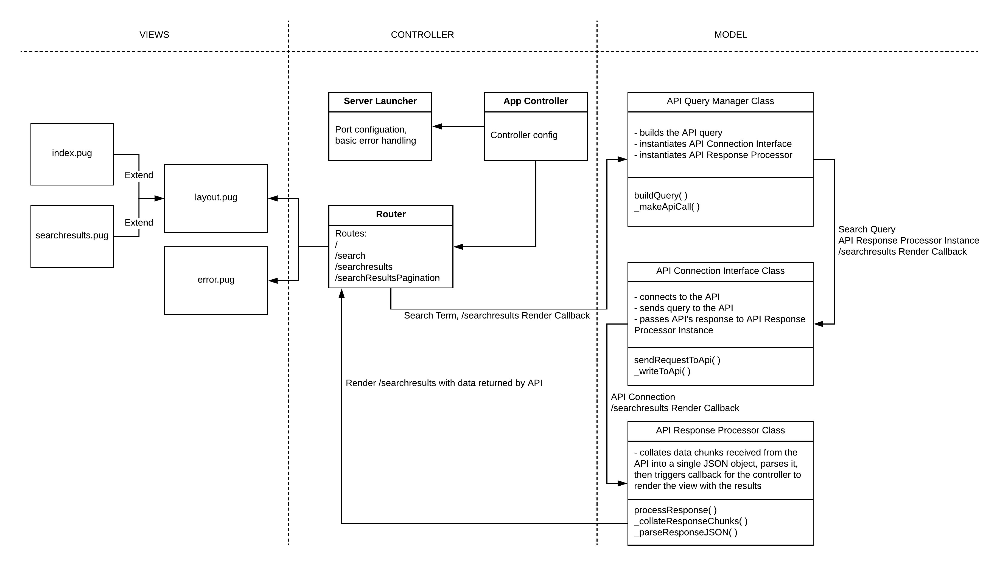

# FT Tech Test
This is a submission for a tech test set by the Financial Times.

This app is deployed on [Heroku](https://ft-headline-search.herokuapp.com/)

## Table of Contents
- [The Task](#the-task)
- [Approach](#approach)
  - [Tech Stack](#tech-stack)
  - [Research](#research)
  - [Design](#design)
    - [MVP](#mvp)
    - [Visual](#visual)
    - [Program Structure](#program-structure)
    - [Final App (screenshots)](#final-app)
- [Getting Started](#getting-started)
  - [FT API Key](#ft-api-key)
  - [Running the app](#running-the-app)
- [Testing](#testing)
  - [Unit Tests](#unit-tests)
  - [Feature Tests](#feature-tests)
  - [Linting](#linting)
- [Deployment](#deployment)
- [Issues, Improvement & Challenges](#issues,-improvement-&-challenges)
- [What I learned](#what-i-learned)
- [Acknowledgements](#acknowledgments)
- [Licensing](#licensing)

## The Task
Build a website that shows a list of news headlines from Financial Times. You may use FT Developer APIs to achieve this.

Provide a search box for users to search for headlines containing specific words (i.e. searching for "brexit" should return a list of brexit-related headlines).

Optionally, provide pagination for results, at 20 results per page.

This website should be:

- Server-rendered
- Progressively enhanced
- Responsive
- Accessible

For bonus points, the site should:
- Be built using JavaScript and Node.js
- Be deployed on Heroku
- Not rely too heavily on client-side frameworks (i.e. Angular, React) or libraries like jQuery
- Have a similar look and feel as ft.com
- Be performant over 3G networks

It'd be really awesome if, on top of all that, your site:
- Uses Origami Components
- Works offline

## Approach

### Tech Stack

I used the following tech stack:

- Language and Environment
  - JavaScript and Node.js (v8.11.2)
- Router and View Engine
  - Express.JS (v4.16.3) with `express-session`
  - Pug (v2.0.0-beta11)
- Testing
  - Unit Testing: Jest (v23.4.0)
  - Feature Testing: Cypress (v3.0.2)
- Other modules
  - `body-parser`
  - `dotenv`
  - `http-errors`

### Research

To better understand how the FT API and various technologies work I:

- reviewed FT API reference to understand how to correctly structure an API query, available options and endpoints, structure of the returned response;
- reviewed the Node.js' [`http.request`](https://nodejs.org/dist/latest-v8.x/docs/api/http.html#http_http_request_options_callback) documentation to understand how to make the HTTP call;
- run [`express-generator`](https://expressjs.com/en/starter/generator.html) to review the standard set up for an Express.JS app; and
- built a small simple app that made a call to the API and printed the response to the console.

I used [Json Parser Online](http://json.parser.online.fr/) by Olivier Cuenot to get a better view of the structure of the returned JSON object.

### Design

#### MVP

I decided that the MVP I wanted to achieve would be:

- a simple search box that would allow the user to enter search terms;
- following a search, a list of up to 20 results would be displayed.

Once MVP was complete, I added some Origami components and the ability to page through results at 20 a time (backwards and forwards).

#### Visual

I mocked up the basic look for the two views (index/root and search results) as follows:


#### Program Structure

The program has been designed with the intention of applying the OOD principles:
 - business logic has been separated into the model layer which handles API connection and query and returns a response;
 - controller acts as command and control module with server launcher and router separated out into separate modules;
 - views handle displaying of the data.



#### Final App

The final result looks as follows:

##### Homepage


##### Search Results


## Getting Started

### FT API Key

The app requires you to have an FT developer API key, which can be obtained at [FT Developer Portal](https://developer.ft.com/portal/member).

### Running the app

To get the app running locally, do the following:

1. Fork and clone the repo
2. Run `npm install` to get the necessary modules installed
3. Create `.env` file in the root directory
4. Setup the API_KEY environment variable in the following format: `API_KEY=your_api_key`
3. Run `npm start` to get the server up and running
4. Log in to localhost:3000

## Testing

### Unit Tests

Run the tests with `npm test`

You should see output similar to this (clipped):

```
...
 PASS  test/apiResponseProcessor.test.js
 PASS  test/apiConnectionInterface.test.js
 PASS  test/apiQueryManager.test.js
---------------------------|----------|----------|----------|----------|-------------------|
File                       |  % Stmts | % Branch |  % Funcs |  % Lines | Uncovered Line #s |
---------------------------|----------|----------|----------|----------|-------------------|
All files                  |    88.57 |      100 |    71.43 |    88.57 |                   |
 apiConnectionInterface.js |    84.62 |      100 |       60 |    84.62 |             20,27 |
 apiQueryManager.js        |      100 |      100 |      100 |      100 |                   |
 apiResponseProcessor.js   |       75 |      100 |    66.67 |       75 |              8,12 |
---------------------------|----------|----------|----------|----------|-------------------|

Test Suites: 3 passed, 3 total
Tests:       14 passed, 14 total
...
```

#### Issues

The coverage is not as high as I would like. This is due to the use of callbacks to deal with server responses which I could not test directly. I extracted the functions called within the callbacks and tested them separately, but the lines with callbacks were not covered by the tests.

### Feature Tests

I planned to use Cypress.io to feature test the app. Due to time constraints, I did not manage to write anything but a very basic test to check that the homepage opens correctly. This is definitely one of the issues that needs improvement.

Run Cypress test with `npm run feature_test`, then click on `Run all specs` in the Cypress GUI.

### Linting

I used Webstorm's built-in ESLint with [JavaScript Standard Style](https://standardjs.com/) plugin.

## Deployment

The app was deployed to Heroku from GitHub. It can be accessed [here](https://ft-headline-search.herokuapp.com/).

## Issues, Improvement & Challenges

### Issues

#### Pagination and Sessions

At the moment, in order to implement pagination, I had to make use of session variables and place the related logic into the controller. It is not the best solution by far since, ideally, there should be only minimal logic in the controller. I would have preferred to use a singleton class option but could not work out how to make a singleton class in Node within a reasonable amount of time, so I had to go with an option that worked.

### Improvements

#### Accessibility

I have provided some very basic accessibility features. ARIA provides quite detailed guidelines on this topic and incorporating these guidelines more fully will definitely improve the app.

#### Search Terms

The FT API allows various search options, such as search by title, sorting and searching various types of content. The app could be improved by providing the user with an opportunity to perform an 'advanced' search that would make a fuller use of the API's capabilities.

#### Adding Images to Search Results

The FT API allows obtaining the url for the image associated with the article. While I did try to implement displaying of the images, I did not know enough of Origami to make images display properly in the correct place and in the end did not implement it, but it is an option for improvement.

#### Better Use of Origami

While I did use some of the Origami components, I had to write some additional CSS for the pages to display as I envisaged. Undoubtedly, this is due to lack of familiarity with Origami and this is an area that could be improved.

### Challenges

#### Promises

I went down a rabbit hole for about a day trying to get an async/await implementation of the code to work. In the end, the solution was to simply use callbacks. I do not consider this time as wasted since I learned how callbacks work and as well as learning a lot about promises in JavaScript.

#### JSON

It was a bit of a challenge to work out how to get the data out of the JSON response received from the API.

#### Resetting sessions

My calculation of the API offset uses sessions to store the current offset. I had a few interesting moments where the app would break because I did not reset the offset stored in session. In the end, implementing a separate route for pagination of results and resetting the session variable on new search resolved this issue.

## What I learned

- I do not know Promises half as much as I should
- It is generally possible to solve problems without having to use async/await
- Origami is cool
- Offset v Cursor API pagination
- Things always take longer than you plan
- Accessibility is a major topic which I need to improve on
- There is usually a way to do what you want to do, even if that produces ugly code - at least that gives you a good place to start

## Acknowledgments

* Makers for getting me to love coding more than I thought was possible and teaching me that 'It is not hard, it's just new'.
* FT for giving me an opportunity to do this tech test and write code that searched their API for `undefined` more times than I care to admit. It does produce about 215 results, by the way :)
* StackOverflow poster (I lost the actual post, apologies) for helping me to get out of async hell by crisply responding to a post by another questioner with 'You don't need promises for this, callback function would suffice'. I learned callbacks then in one of those 'Aha!' moments. Thank you!

## Licensing

FT places certain requirements in respect of information necessary to include in the API query string, and display of FT logo for attribution purposes. I have complied with these requirements.

---
`Prepared by: Igor Ryabchuk`

